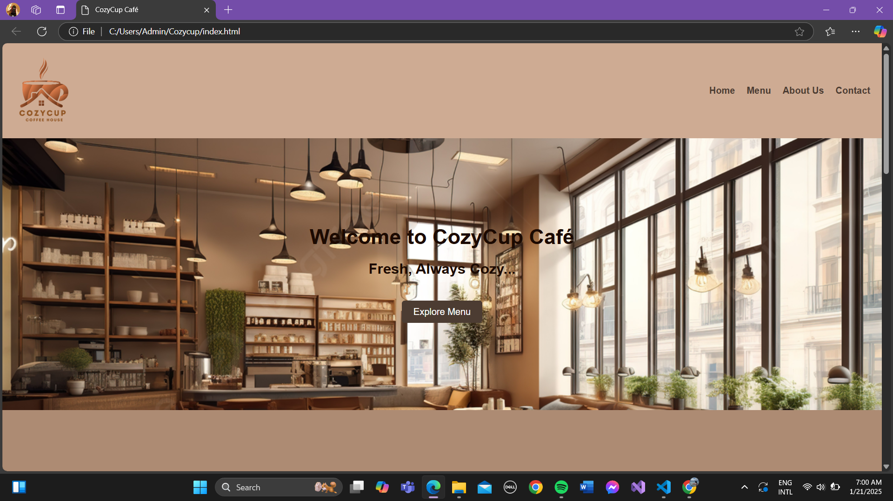
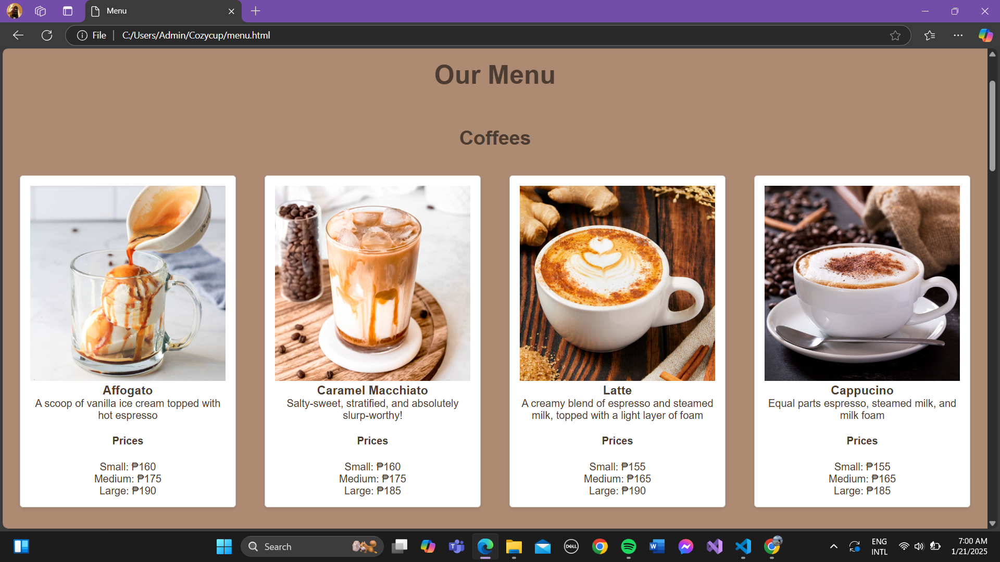
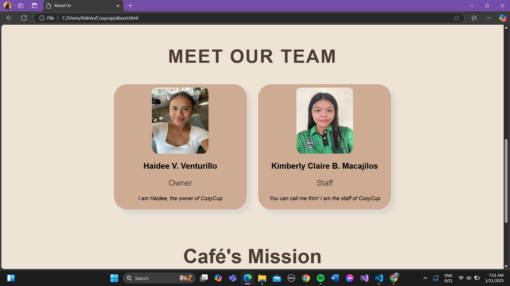
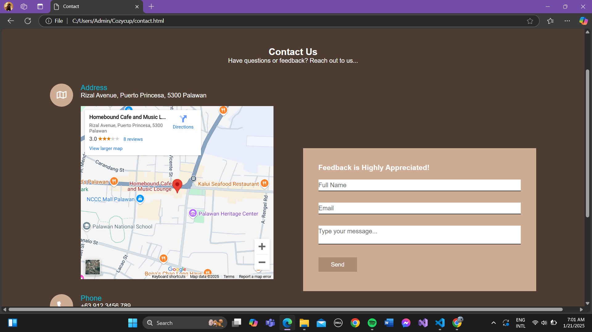
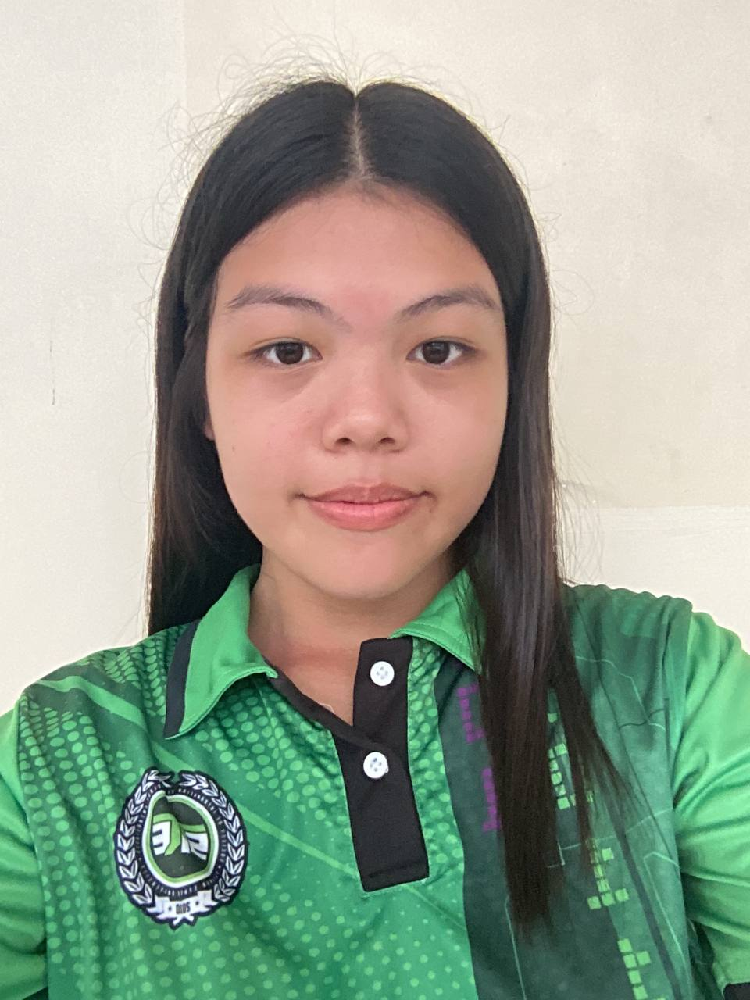

# CozyCup Cafe

### Project Description
This project is a cafe website where it showcases the different coffees and pastries that the cafe has to offer.

### Features
* Home
* Menu
* About Us
* Contact

### Screen Captures

This is the home page of the website. This briefly shows the menu, about us, and contact.

This page shows the variety of coffees and pastries that the cafe sells.

The about us page shows the short story of how the business was created and the team of the cafe.

Contact page is for contacting the owners for feedback or questions.

### About the Authors
This project was made by two person, Haidee V, Venturillo and Kimberly CLaire B. Macajilos. Both are 
currently 3rd year student with a course of Information Technology in Palawan State University.

**Name: Kimberly Claire B. Macajilos**

**Email: 202280322@psu.palawan.edu.ph**

<a href="https://www.facebook.com/kimmyclairee" target="_blank">
  <button></button>
</a>
<a href="https://github.com/kimberlymacajilos" target="_blank">
  <button></button>
</a>

